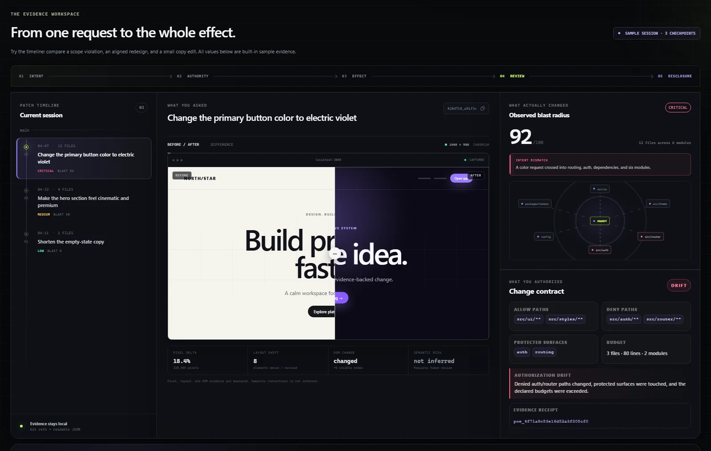

<p align="center">
  
</p>

<h1 align="center">PatchOath</h1>

<p align="center"><strong>Make every AI patch prove it stayed in scope.</strong></p>
<p align="center">Set the boundary before an agent edits. See what crossed it afterward.<br />A local CLI and evidence dashboard for reviewing AI-assisted code changes.</p>

<p align="center">
  <a href="https://github.com/feifeing/PatchOath/actions/workflows/ci.yml"></a>
  <a href="LICENSE"></a>
  
  
</p>

<p align="center">
  <a href="#try-the-dashboard">Try the dashboard</a> ·
  <a href="#review-your-first-change">Review a real change</a> ·
  <a href="docs/getting-started.md">Getting started</a> ·
  <a href="README.zh-CN.md">简体中文</a>
</p>

<p align="center">
  
</p>
<p align="center"><sub>Actual dashboard capture with built-in sample checkpoints. Your own evidence appears in reports generated by the CLI.</sub></p>

You asked an agent to change a button. It also changed authentication, routing, and dependencies. The page still works—but did the patch stay inside the boundary you set?

PatchOath connects **what you allowed** to **what Git recorded**, then presents the difference for human review. It works alongside your coding agent and Git workflow; no model or cloud account is needed for the core evidence workflow.

| Before the change                                        | After the change                                       | At review time                                                                 |
| -------------------------------------------------------- | ------------------------------------------------------ | ------------------------------------------------------------------------------ |
| Declare allowed paths, protected paths, and size limits. | Capture Git changes and optional before/after visuals. | Inspect scope violations, changed files, risk reasons, and evidence integrity. |

## Try the dashboard

Requires **Node.js 20+**, npm, and Git.

```bash
git clone https://github.com/feifeing/PatchOath.git
cd PatchOath
npm ci
npm run dev
```

Open [http://127.0.0.1:4173](http://127.0.0.1:4173). Select a checkpoint, inspect its Change Contract, compare the evidence, and follow the review timeline. The development dashboard uses bundled sample data; it does not scan your repositories.

PatchOath is an **open-source alpha**. The package remains `private: true`; install from this repository rather than assuming a public npm package is available.

## Review your first change

From the cloned PatchOath directory, link the CLI:

```bash
npm link
```

In the Git repository you want to review, initialize PatchOath and start a checkpoint **before** the agent edits. Adjust the paths and limits to match your project:

```bash
patchoath init
patchoath checkpoint --prompt "Change the primary button color" --allow "src/components/**,src/styles/**" --deny "src/auth/**,src/router/**" --max-files 3 --max-lines 80
```

Let the agent make the change. Then inspect and capture the result:

```bash
patchoath diff
patchoath checkpoint --finish
patchoath verify
patchoath report --open
```

The generated report uses your recorded evidence and can be opened locally without a server. Starting and finishing checkpoints preserve `HEAD` and the real Git index.

A narrow request can reveal a wider effect:

```text
asked       Change the primary button color
allowed     components + styles · ≤3 files · ≤80 lines
observed    12 files · auth + routing touched
authority   contract violated
review      human follow-up required
```

A denied path remains a violation even when the page looks correct. Renames check both the source and destination: moving an authentication file into a UI directory does not erase the source boundary.

For existing edits, use `patchoath attest` with a declared contract. For a walkthrough, optional screenshots, and common setup questions, see [Getting started](docs/getting-started.md).

## Evidence you can inspect

| Feature                 | What it answers                                                                        |
| ----------------------- | -------------------------------------------------------------------------------------- |
| **Change Contract**     | Which paths, sensitive surfaces, and change budgets did you explicitly permit?         |
| **Authorization Drift** | Did the observed patch cross that declared boundary?                                   |
| **Blast Radius**        | How far did the change spread, and which deterministic factors deserve review?         |
| **Visual evidence**     | How did captured pixels, basic layout, and DOM fingerprints change?                    |
| **Evidence Receipt**    | Does the available evidence still match its versioned SHA-256 receipt?                 |
| **Trust Graph Doctor**  | Do the local sessions, checkpoints, receipts, refs, reviews, and capsules still agree? |
| **Historical review**   | What conclusion did a human record about this exact captured change?                   |
| **Evidence Capsule**    | What smaller, explicitly controlled evidence set can you disclose?                     |
| **Guarded restore**     | Can the recorded before-state be restored without overwriting later work?              |

Optional visual capture uses Playwright. Git submodules are recorded as commit pointers; uncommitted changes inside them must be committed or discarded before a parent checkpoint can capture them. See [Getting started](docs/getting-started.md) for setup and capture coverage.

Run `patchoath doctor` for a read-only audit of the local evidence graph, or `patchoath doctor --json` for diagnostics on standard output. Exit `0` means no failed check (warnings may remain), `1` means the command could not complete, and `2` means broken evidence invariants were found. An uninitialized repository with an inspectable committed `HEAD` is a warning; doctor does not initialize or repair it. See [Trust Graph Doctor](docs/trust-graph-doctor.md).

Git-ignored contents are outside snapshot capture. Coverage diagnostics retain only an ignored-root count and a digest of the root set, not ignored names or contents; this metadata is not bound into current receipts. It describes capture eligibility, rather than claiming every eligible file appears in a selected diff scope.

## Clear boundaries, useful evidence

```text
Intent → Authority → Effect → Review → Disclosure
```

**Intent is context, not permission.** A prompt helps explain the request; the explicit Change Contract determines the boundary.

**Review is historical.** `patchoath review --accept-effect` records a conclusion about an observed change. It does not alter the original contract or grant future authority. Reviewer names are labels, not authenticated identities.

**Receipts check consistency.** Verification does not prove authorship, semantic correctness, trusted execution, or that the code is safe. Risk scores are explainable review heuristics, and visual differences do not establish semantic regressions.

**Disclosure is a separate choice.** A full local report may include prompts, paths, contract patterns, and screenshots. `patchoath capsule --json` creates a smaller evidence artifact whose defaults omit prompt text, changed paths, full contract patterns, patches, and screenshot bytes. Inspect any artifact before sharing it.

**Restore is explicit.** `patchoath restore` previews the operation. `patchoath restore --apply` performs it only after checking for later worktree drift.

PatchOath combines established techniques under these boundaries; it does not claim to have invented diff tracking, checkpoints, risk scoring, receipts, or selective disclosure. See [Related work](docs/related-work.md).

## CLI at a glance

| Command                             | Purpose                                                             |
| ----------------------------------- | ------------------------------------------------------------------- |
| `patchoath init`                    | Initialize local evidence state.                                    |
| `patchoath doctor [--json]`         | Audit the local evidence graph without changing it.                 |
| `patchoath checkpoint --prompt "…"` | Start a checkpoint with optional contract rules and visual capture. |
| `patchoath checkpoint --finish`     | Capture the result and bind its evidence.                           |
| `patchoath diff [id]`               | Inspect the live or recorded effect.                                |
| `patchoath attest …`                | Check existing worktree edits against a contract.                   |
| `patchoath verify [id]`             | Verify the receipt, Git evidence, and available visual artifacts.   |
| `patchoath contract-delta [id]`     | Derive a restricted proposal for the exact historical effect.       |
| `patchoath review …`                | Record or verify a historical human conclusion.                     |
| `patchoath capsule …`               | Create or verify controlled disclosure evidence.                    |
| `patchoath replay`                  | Show the current session timeline.                                  |
| `patchoath report [id] --open`      | Open a standalone local evidence dashboard.                         |
| `patchoath restore [id]`            | Preview a guarded restore; add `--apply` to perform it.             |

Run `patchoath --help` for the top-level workflow. Detailed documentation:

- [Change Contracts](docs/change-contract.md) · [Evidence Receipts](docs/evidence-receipts.md)
- [Review Control Plane](docs/review-control-plane.md) · [Historical Effect Review](docs/historical-effect-review.md)
- [Disclosure boundary](docs/disclosure-boundary.md) · [Architecture](docs/architecture.md)
- [Security policy](SECURITY.md) · [Release readiness](docs/release-readiness.md)
- [Trust Graph Doctor](docs/trust-graph-doctor.md)

## Legacy compatibility

PatchOath v0.3 preserves evidence from the earlier VibeTrace alpha. New work uses `.patchoath/`, `refs/patchoath/`, and `po_…`, `poe_…`, `pocd_…`, `pod_…`, `por_…` identifiers.

Legacy `.vibetrace/`, `refs/vibetrace/`, and `vt_…`, `vtr_…`, `vtcd_…`, `vtd_…`, `vrr_…` records remain readable and verifiable under their original semantics. The old `vibetrace` executable is a deprecated compatibility shim; new examples use `patchoath`.

## Help shape PatchOath

Try it on a small change first. Useful contributions include reproducible Git edge cases, clearer review explanations, accessibility improvements, and evidence-capture fixes. Read [CONTRIBUTING.md](CONTRIBUTING.md) for setup and the product boundaries.

- [Report a bug](https://github.com/feifeing/PatchOath/issues/new?template=bug_report.yml) with a minimal, safe reproduction.
- [Propose an improvement](https://github.com/feifeing/PatchOath/issues/new?template=feature_request.yml) around a concrete review problem.
- If PatchOath helps you review AI changes, [give the project a star](https://github.com/feifeing/PatchOath) so others can find it.

Automated validation covers Node 20/22, Chromium interactions and responsive layout, packaged CLI smoke tests on Ubuntu and Windows, formatting, and the rights/release gate. These checks support the behaviors they test, rather than a general security guarantee.

MIT licensed. See [LICENSE](LICENSE), [LEGAL.md](LEGAL.md), [THIRD_PARTY_NOTICES.md](THIRD_PARTY_NOTICES.md), [asset provenance](docs/asset-provenance.md), and [brand clearance](docs/brand-clearance.md).
